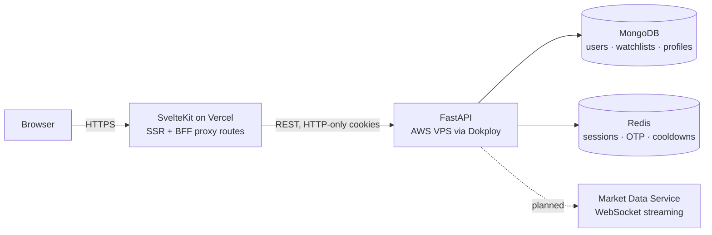

<div align="center">

# Svakosh

**A full-stack stock market analytics platform — equity and derivatives — built for speed, with a hand-rolled UI system and near-zero third-party dependencies.**

[**Live Demo**](https://svakosh.vercel.app) · [**Report an Issue**](https://github.com/Deepak-GitHub1474/svakosh/issues)

`SvelteKit` · `Svelte 5` · `TypeScript` · `Tailwind CSS v4` · `FastAPI` · `MongoDB` · `Redis` · `Docker`

</div>

---

## Overview

Svakosh is a market analytics workspace for Indian equities and derivatives. It pairs a **passwordless authentication system** — WebAuthn passkeys, Google OAuth, and OTP — with **multi-watchlist tracking** and **17 charting dashboards** covering open interest, max pain, straddle/strangle spreads, PCR, and breakout screeners.

The project exists to answer a specific question: *how fast can a data-dense trading interface be if you refuse to reach for a component library?*

Every interactive element — modal, drawer, toast, tabs, selector, tooltip, switch — is written from scratch. The entire frontend ships **three runtime dependencies**.

> **Current data status.** Authentication, profile, and watchlist are wired end-to-end against the FastAPI backend. The analytics dashboards render against typed interfaces backed by **simulated mock data** while the market-data ingestion service is built — see [Roadmap](#roadmap) and [Disclaimer](#disclaimer).

---

## Why It's Fast

Most dashboards are slow because of what they install, not what they render. Svakosh inverts that.

| | |
|---|---|
| **3 runtime dependencies** | `echarts` for charts, `tailwind-merge` for class resolution, `@simplewebauthn/browser` for passkeys. Nothing else. |
| **No component library** | 17 custom components. No Material UI, no shadcn, no Skeleton, no Flowbite — no framework's opinions, no framework's bundle. |
| **No icon font** | 52 Material Design icons compiled to local inline SVG components. Zero network requests, zero FOUT — icon fonts render their ligature *text* until the font loads, which visibly breaks layout on slow connections. |
| **Server-side rendered** | SvelteKit SSR means first paint carries real content, not a loading skeleton. |
| **Svelte 5 runes** | Fine-grained reactivity compiles away the virtual DOM. No reconciliation cost on live price updates. |
| **Route-level code splitting** | Each dashboard loads only its own chart logic. |

---

## Features

### 🔐 Authentication & Security

Passwordless by default, with layered fallbacks:

- **WebAuthn passkeys** — register and sign in with fingerprint, face, or device PIN. Full credential lifecycle with per-device management.
- **Google OAuth** — ID-token verification against Google's JWKS with issuer validation and account linking to existing profiles.
- **OTP verification** — HMAC-hashed codes in Redis with TTL expiry, failure lockout, and resend cooldown.
- **JWT access/refresh rotation** — short-lived access tokens, rotating refresh tokens, HTTP-only cookies, and server-side session revocation.
- **Argon2 password hashing** and application-level field encryption for sensitive profile data.

### 📊 Watchlists

- Multiple named watchlists per user, plus curated predefined lists
- Symbol search with add/remove and duplicate protection
- Per-symbol private notes
- Sort by name, LTP, absolute change, or percentage change
- Rename and delete with confirmation flows

### 📈 Market Analytics

Seventeen dashboards across equity and derivatives:

**Open Interest** — OI Tracker · Lookup · Glimpse · Buildup · Call vs Put · Multi-Symbol OI · Max Pain

**Options Strategy** — Straddle Analysis · Strangle Analysis · Air-in-Premiums · Options Chart

**Equity** — Stock Screener · 52-Week Breakout · Volume Breakout

**Market** — Market Pulse · Market Overview · Options Analytics

### 🎨 UI System

A cohesive component set where every element behaves consistently across every route:

`Avatar` · `Badge` · `Button` · `Card` · `Drawer` · `Input` · `Label` · `Loader` · `Modal` · `MultiSelector` · `NumberInput` · `Selector` · `Switch` · `Tabs` · `Toast` · `Toaster` · `Tooltip`

Design decisions that carry through the whole app:

- **Theme tokens, never raw colours.** Components consume `--primary`, `--bullish`, `--bearish`, `--border-subtle`. Retheming is a variable change, not a find-and-replace.
- **`class` prop on every component**, merged via `tailwind-merge` so a caller's utility always wins over the default.
- **One overlay z-scale**, documented and enforced — modals, drawers, sheets, and popovers never fight.
- **Responsive by construction.** The watchlist is a docked rail on desktop and a full-screen overlay on mobile — same component, one breakpoint branch.

---

## Architecture



**The frontend never talks to the API directly from the browser.** SvelteKit server routes under `src/routes/api/**` act as a backend-for-frontend layer: they hold the auth cookies, forward requests server-side, and transparently retry once after refreshing an expired access token. Tokens never touch client JavaScript.

### Predictable response contract

Every endpoint — success or failure, including unhandled exceptions — returns the same envelope:

```json
{
  "success": true,
  "message": "Watchlist created.",
  "data": { "name": "My Fav", "predefined": false, "count": 0 }
}
```

Centralised exception handlers cover validation errors, HTTP errors, and uncaught exceptions, so the client has exactly one shape to parse. No endpoint invents its own error format.

### Layered backend

```
app/
├── main.py               # app factory, CORS, middleware registration
├── config.py             # typed settings via pydantic-settings
├── responses.py          # ok_response / err_response envelope
├── error_handlers.py     # centralised exception handling
├── api/endpoints/
│   ├── auth/             # routes · controllers · models · utils
│   ├── profile/
│   ├── watchlist/
│   └── health.py
├── database/             # Mongo + Redis clients
└── utils/                # crypto, encoding, shared helpers
```

Each domain splits **routes** (HTTP surface) from **controllers** (business logic) from **models** (Pydantic schemas). Adding a domain means adding a folder — no existing file grows.

### Feature-scoped frontend

```
src/
├── lib/
│   ├── components/
│   │   ├── svakosh/      # the design system
│   │   ├── svg-provider/ # local SVG icon components
│   │   ├── watchlist/    # feature module
│   │   └── header/ sidebar/ account/ dashboard/
│   ├── store/            # runes-based global state
│   ├── config/           # environment presets
│   └── utils/
└── routes/
    ├── (app)/            # authenticated shell
    │   ├── oi/ charts/ stocks/ market-pulse/ settings/ profile/
    │   └── +layout.server.ts
    ├── auth/             # sign-in, OTP, passkey, OAuth
    └── api/              # BFF proxy routes
```

Each feature keeps its own `_components/`, `_lib/helper.ts`, and `_lib/types.ts` beside its route. Deleting a feature is deleting a folder.

---

## Tech Stack

| Layer | Technology |
|---|---|
| **Framework** | SvelteKit · Svelte 5 (runes) |
| **Language** | TypeScript (frontend) · Python 3.13 (backend) |
| **Styling** | Tailwind CSS v4 · CSS custom-property theme tokens |
| **Charts** | Apache ECharts |
| **API** | FastAPI · Pydantic v2 |
| **Database** | MongoDB (Motor async driver) |
| **Cache & Sessions** | Redis |
| **Auth** | WebAuthn · Google OAuth (JWKS) · PyJWT · Argon2 |
| **Tooling** | pnpm · uv · ESLint · Prettier · svelte-check |
| **Deployment** | Vercel (frontend) · AWS VPS + Dokploy + Docker Compose (backend) |

---

## Getting Started

**Prerequisites:** Node 20+, [pnpm](https://pnpm.io/), Python 3.13+, [uv](https://docs.astral.sh/uv/), and a running MongoDB and Redis.

```bash
git clone https://github.com/Deepak-GitHub1474/svakosh.git
cd svakosh
```

**Backend**

```bash
cd backend
uv sync                       # install from uv.lock
cp .env.example .env          # then fill in the values
uv run uvicorn app.main:app --reload --port 8000
```

**Frontend**

```bash
cd frontend
pnpm install
pnpm dev                      # http://localhost:5173
```

Full environment variable tables live in [`backend/README.md`](backend/README.md) and [`frontend/README.md`](frontend/README.md).

### Useful commands

| Command | What it does |
|---|---|
| `pnpm dev` | Frontend dev server |
| `pnpm check` | Type-check with `svelte-check` |
| `pnpm lint` | Prettier + ESLint |
| `pnpm validate` | check + lint + build |
| `uv run uvicorn app.main:app --reload` | Backend with hot reload |

---

## Roadmap

Planned work, roughly in order:

- [ ] **Market-data ingestion microservice** — a separate service consuming live exchange data, decoupled from the API so ingestion can scale independently
- [ ] **WebSocket streaming** — push live LTP, OI, and option-chain updates to the client; `SVAKOSH_WS_URL` is already wired through the config layer
- [ ] **Replace the stubbed data layer** with the live feed. Dashboards already consume typed interfaces, so this is a service-layer swap rather than a UI rewrite
- [ ] **Full option chain** with strike-wise Greeks and live OI change
- [ ] **OTP delivery** — SMTP and SMS provider integration. Generation, hashing, expiry, lockout, and verification are complete; only the transport adapter is stubbed
- [ ] **Optional password login** — user-enabled from Settings, so accounts can keep passwordless-only as the default while allowing a password fallback for those who want one
- [ ] **Price and OI alerts** with browser push notifications
- [ ] **Portfolio tracking** with realised and unrealised P&L

---

## Conventions

Commits follow a fixed prefix set:

| Prefix | Use when |
|---|---|
| `feat:` | New behaviour clients can rely on |
| `fix:` | Bug fix, no new feature |
| `refactor:` | Internal structure, same external behaviour |
| `optimization:` | Performance, same contract |
| `style:` | Formatting, logs, docs text only |
| `docs:` | Documentation only |

Code quality gates: `pnpm validate` on the frontend, `uv sync` committed alongside `pyproject.toml` and `uv.lock` on the backend.

---

## Disclaimer

**Svakosh is a personal portfolio project built to demonstrate full-stack engineering. It is not a commercial product, a financial service, or a trading platform.**

**All market data shown is simulated.** Every number, chart, price, and open-interest figure in the analytics dashboards is generated from static mock fixtures committed to this repository. Nothing is sourced from any exchange, broker, or market data vendor. Nothing is live, delayed, or historically accurate.

Specifically:

- **No investment advice.** Nothing here is a recommendation to buy, sell, or hold any security. No output should inform a real trading decision.
- **No affiliation.** Not affiliated with, endorsed by, or connected to NSE, BSE, SEBI, any broker, or any market data provider. Instrument names and symbols appear only as realistic sample data.
- **No regulatory standing.** This project is not a registered investment adviser, research analyst, or broker, and makes no claim to comply with any financial regulation.
- **No service commitment.** The demo deployment carries no uptime, availability, accuracy, or data-retention guarantee, and may change or disappear without notice.
- **No warranty.** Provided as-is, without warranty of any kind. The author accepts no liability for any loss arising from use of this code or the demo.

Do not treat this application as a source of market information. It exists to showcase architecture, authentication design, UI engineering, and code quality.

---

<div align="center">

Built by **[Deepak Chaudhary](https://github.com/Deepak-GitHub1474)**

</div>
